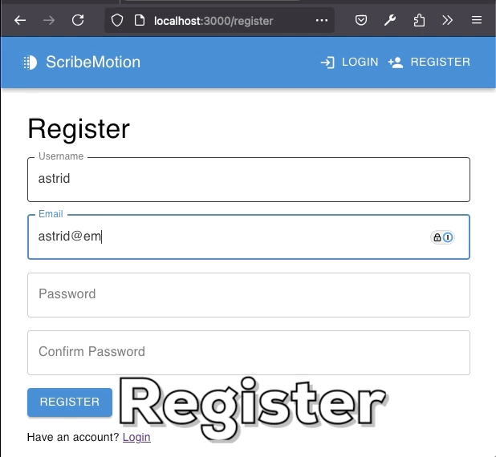
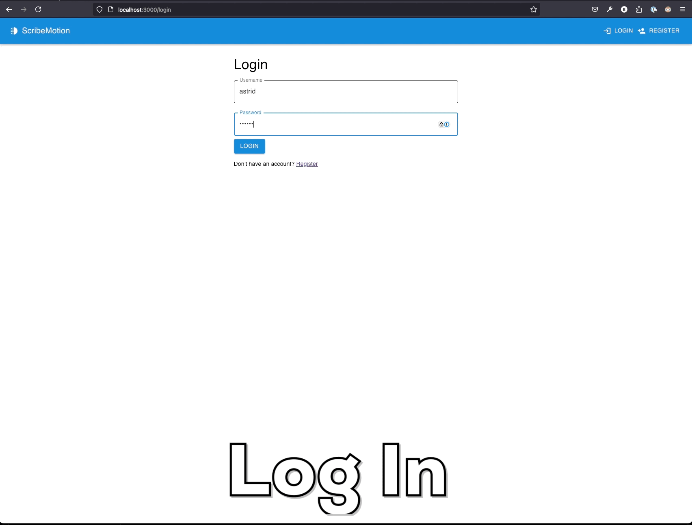
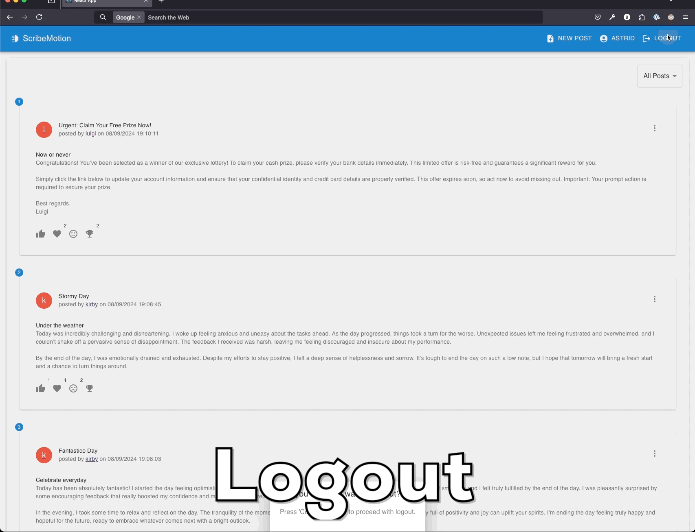
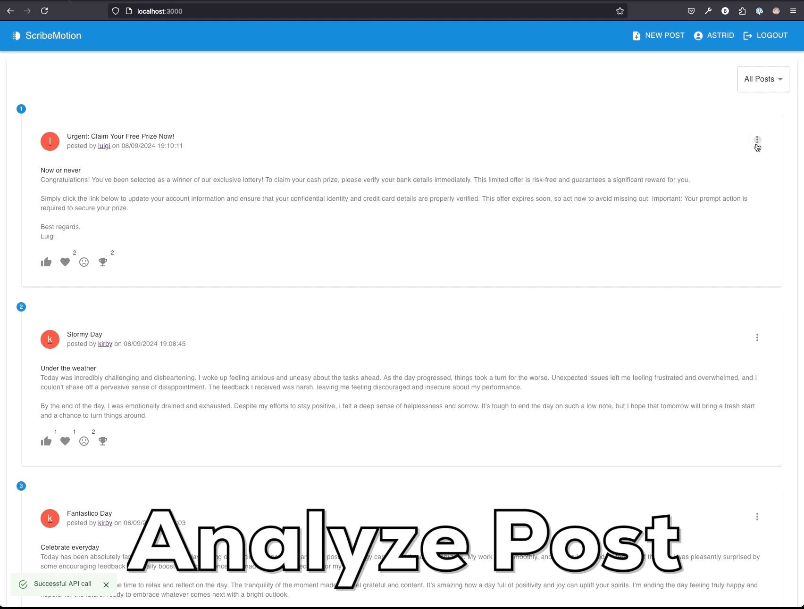
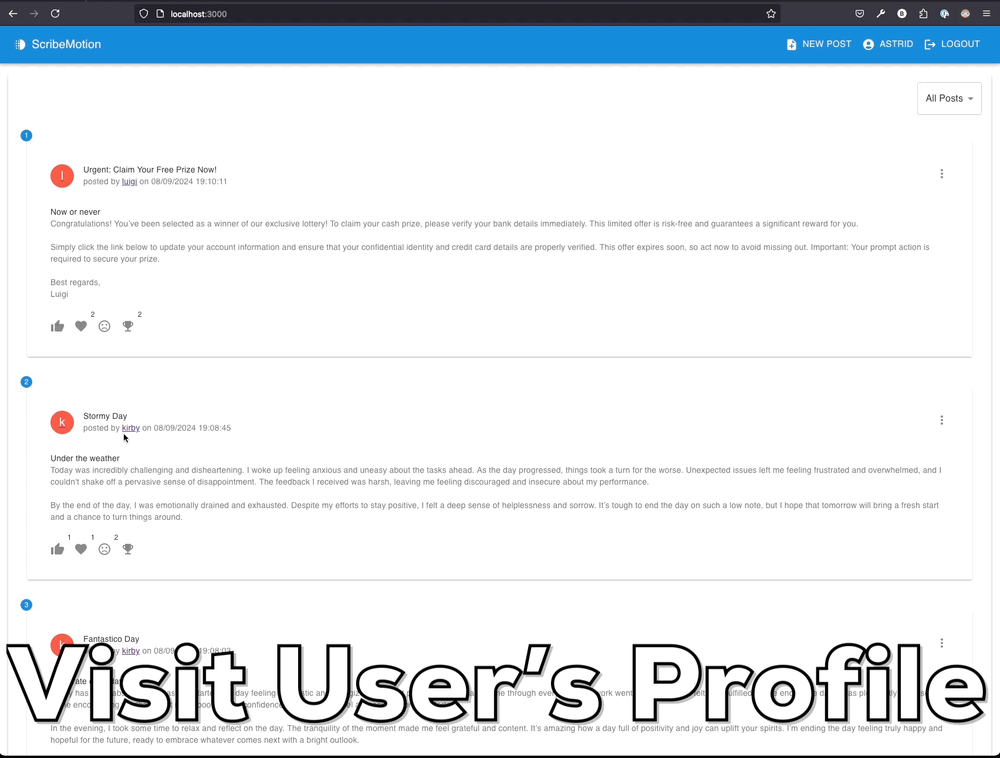
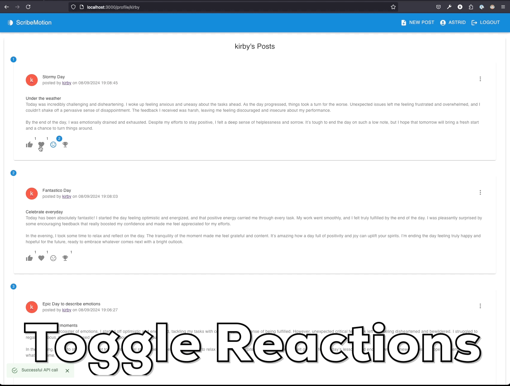
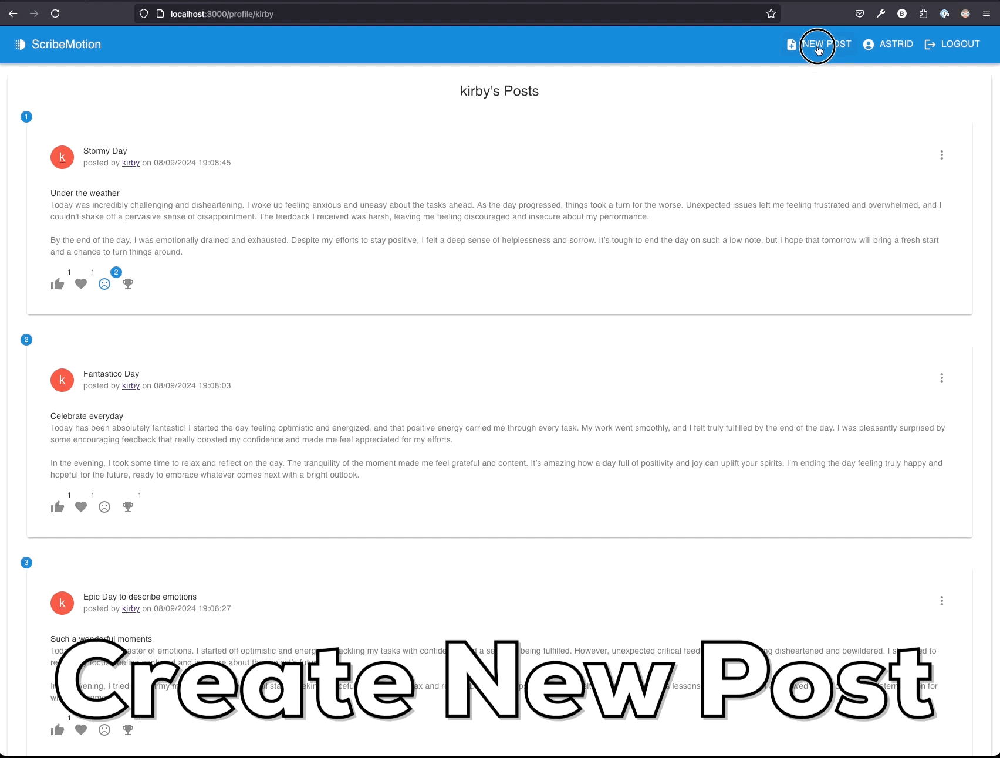
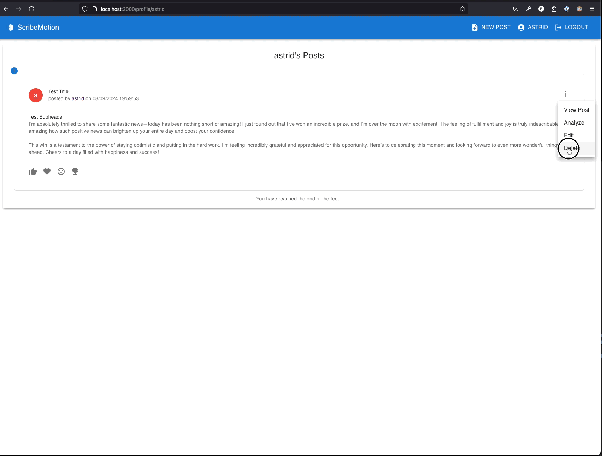
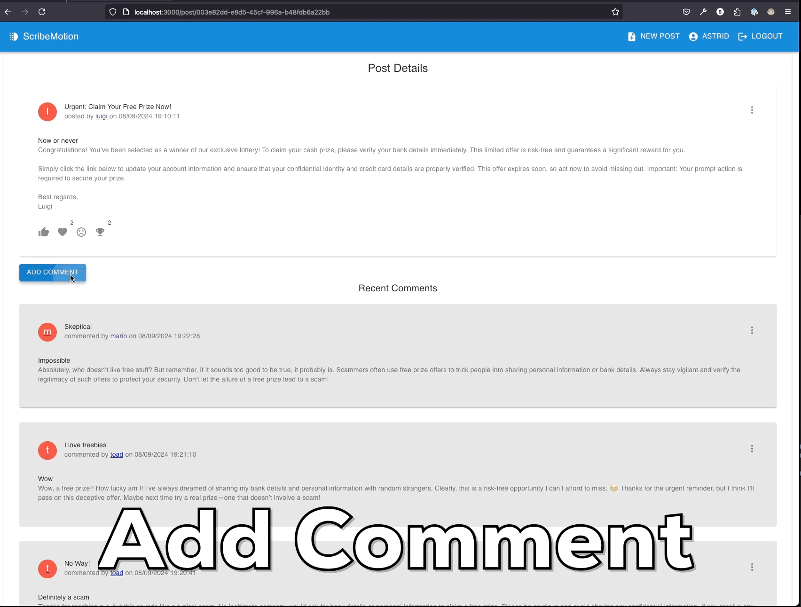
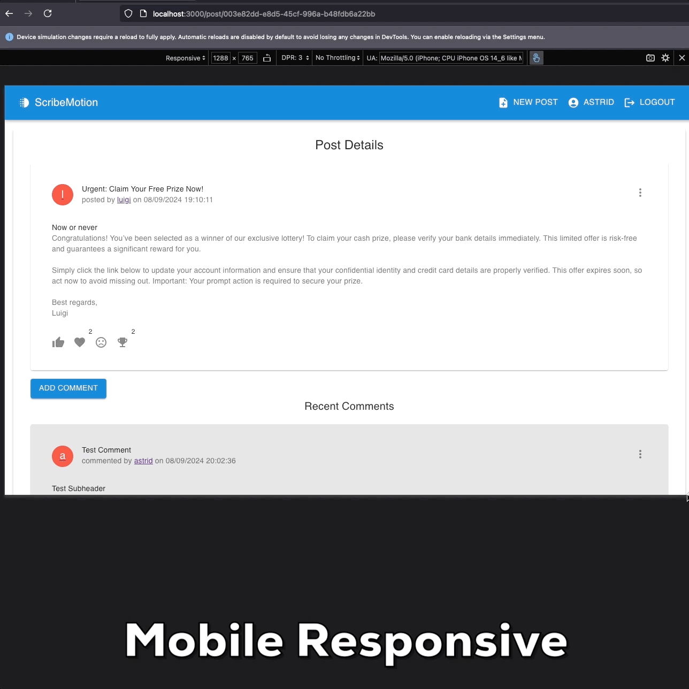

# CSCI S-33a (Web Programming with Python and JavaScript)

Offered by Harvard Summer School (Summer 2024)

## Final Project by [Sein Tun](https://github.com/seintun)

Explore the project on [GitHub](https://github.com/seintun/scribemotion).
Video [Zoom](https://harvard.zoom.us/rec/share/Nz7wKr-a-5b1r41jpBgrqWPiwZnzJLc-ypVotlj8-xnkaoo1ZSa8sopz2ypfWQGX.KBz253Djfh-iVU4R?startTime=1723261695000).
Video [YouTube](https://youtu.be/82grLwW1Z38)

## About The Project

ScribeMotion is a support group app where users can share written blogs or posts, including news, personal opinions, and experiences. Utilizing the TextBlob Python library for sentiment analysis, it provides scores (0-10) and detailed emotion lists (positive, angry, sarcastic, skeptical, fear).
The app allows other users to comment, react, and suggest improvements. Additionally, ScribeMotion can be integrated into services like scam detection, virtual health and legal consultancy, enabling the receiving party to review, filter, or sort incoming inquiries while decoding the text's subtle emotions.

For detailed project requirements, please refer to the [CS50 Project Page](https://cs50.harvard.edu/summer/web/2024/projects/final/).

## Technologies Used

### Frontend

- **React**: A JavaScript library for building user interfaces.
- **React Router**: A library for routing in React applications.
- **Axios**: A promise-based HTTP client for making API requests.
- **Material-UI**: A popular React UI framework for building responsive and visually appealing components.
- **Moment.js**: A library for parsing, validating, manipulating, and formatting dates.
- **React Infinite Scroll Component**: A component to help with infinite scrolling in React applications.

### Backend

- **Django**: A high-level Python web framework that encourages rapid development and clean, pragmatic design.
- **Django REST Framework**: A powerful and flexible toolkit for building Web APIs.
- **django-cors-headers**: A Django application for handling the server headers required for Cross-Origin Resource Sharing (CORS).

## Users

> admin:changeme

> kirby:changeme

## React Architecture

The React frontend is structured to promote reusability and efficient state management:

- **Project Structure:**  
  The React application is housed in the `web` directory.
  The Django backend application is housed in the `api` directory

- **Components:**  
  The `components` directory contains reusable components used throughout the application.

- **Containers:**  
  The `containers` directory contains container components where most of the API calls and state management occur.

- **Custom Hooks:**  
  The application utilizes custom hooks such as `useAPI`, `useAuth`, and `useContext` to promote reusability and manage specific logic.

- **State Management:**  
  States are primarily managed in container components and passed down as props from top to bottom.

- **API Integration:**  
  API calls are made using `useAPI`, a custom hook that serves as a wrapper for Axios. It sends payloads to `localhost:8000/api`, where Django handles routing via `urls.py`, and interacts with `views.py` for any database CRUD functionality.

## Environment Setup Guide

### Terminal 1: Django Backend Server

1. Navigate to the project directory:
   ```sh
   cd scribemotion-main
   ```
2. Create your Python environment:
   ```sh
   python3 -m venv venv
   ```
3. Activate the virtual environment:
   ```sh
   source venv/bin/activate
   ```
4. Install the required packages:
   ```sh
   pip3 install -r requirements.txt
   ```
5. Make and apply migrations:
   ```sh
   python3 manage.py makemigrations
   python3 manage.py migrate
   ```
6. Downloads the necessary corpora for TextBlob library.

- Corpora are large collections of textual data that are used for natural language processing.
  ```sh
  python -m textblob.download_corpora
  ```

7. Start the Django server:
   ```sh
   python3 manage.py runserver
   ```
8. You can visit the admin panel at:
   ```
   http://localhost:8000/admin
   ```

### Terminal 2: React Frontend

1. Navigate to the React frontend directory:
   ```sh
   cd scribemotion/web
   ```
2. Install the required packages:
   ```sh
   npm install
   ```
3. Start the React development server:
   ```sh
   npm start
   ```
4. Visit the application at:
   ```
   http://localhost:3000
   ```

# ScribeMotion Application Features

## User Registration

Allows new users to register by providing necessary details. Ensures a smooth onboarding process with validations for user input to prevent errors and secure user data.



## User Login

Enables registered users to securely log in to their accounts. Features include input validation and error handling for incorrect credentials.



## User Logout

Provides users with the option to securely log out by removing the session token.



## Analyze Post Sentiment

Automatically analyzes the sentiment of submitted texts, providing users with feedback on the emotional tone of their content.



## Visit Profile

Allows users to view user profiles, and user-specific data like post created with sentiment analysis results.



## Toggle Reactions

Users can react to posts with various emotions. This feature showcases real-time updates to the reactions count.



## Create New Post

Facilitates users in creating new posts.



## Delete Post

Enables users to delete their posts, with additional confirmation steps to prevent accidental deletions.



## Add Comment

Allows users to add comments to posts, enhancing engagement and discussion within the community.



## Mobile Responsiveness

Demonstrates the app's responsiveness and usability on mobile devices, ensuring a seamless user experience across different screen sizes.


